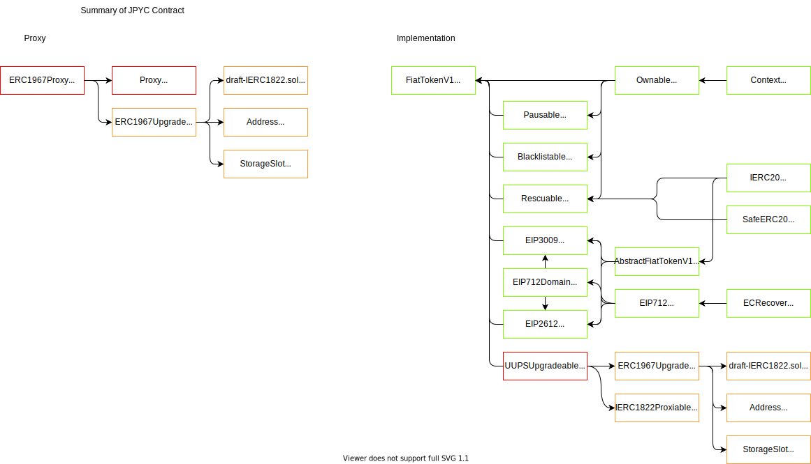

# ✨ So you want to sponsor a contest

This `README.md` contains a set of checklists for our contest collaboration.

Your contest will use two repos: 
- **a _contest_ repo** (this one), which is used for scoping your contest and for providing information to contestants (wardens)
- **a _findings_ repo**, where issues are submitted. 

Ultimately, when we launch the contest, this contest repo will be made public and will contain the smart contracts to be reviewed and all the information needed for contest participants. The findings repo will be made public after the contest is over and your team has mitigated the identified issues.

Some of the checklists in this doc are for **C4 (🐺)** and some of them are for **you as the contest sponsor (⭐️)**.

---

# Contest setup

## ⭐️ Sponsor: Provide contest details

Under "SPONSORS ADD INFO HERE" heading below, include the following:

- [ ] Name of each contract and:
  - [ ] source lines of code (excluding blank lines and comments) in each
  - [ ] external contracts called in each
  - [ ] libraries used in each
- [ ] Describe any novel or unique curve logic or mathematical models implemented in the contracts
- [ ] Does the token conform to the ERC-20 standard? In what specific ways does it differ?
- [ ] Describe anything else that adds any special logic that makes your approach unique
- [ ] Identify any areas of specific concern in reviewing the code
- [ ] Add all of the code to this repo that you want reviewed
- [ ] Create a PR to this repo with the above changes.

---

# ⭐️ Sponsor: Provide marketing details

- [x] Your logo (URL or add file to this repo - SVG or other vector format preferred)
- [x] Your primary Twitter handle
- [x] Any other Twitter handles we can/should tag in (e.g. organizers' personal accounts, etc.)
- [ ] Your Discord URI
- [ ] Your website
- [ ] Optional: Do you have any quirks, recurring themes, iconic tweets, community "secret handshake" stuff we could work in? How do your people recognize each other, for example? 
- [ ] Optional: your logo in Discord emoji format

---

# Contest prep

## 🐺 C4: Contest prep
- [x] Rename this repo to reflect contest date (if applicable)
- [x] Rename contest H1 below
- [x] Add link to report form in contest details below
- [x] Update pot sizes
- [x] Fill in start and end times in contest bullets below.
- [ ] Move any relevant information in "contest scope information" above to the bottom of this readme.
- [ ] Add matching info to the [code423n4.com public contest data here](https://github.com/code-423n4/code423n4.com/blob/main/_data/contests/contests.csv))
- [ ] Delete this checklist.

## ⭐️ Sponsor: Contest prep
- [ ] Make sure your code is thoroughly commented using the [NatSpec format](https://docs.soliditylang.org/en/v0.5.10/natspec-format.html#natspec-format).
- [ ] Modify the bottom of this `README.md` file to describe how your code is supposed to work with links to any relevent documentation and any other criteria/details that the C4 Wardens should keep in mind when reviewing. ([Here's a well-constructed example.](https://github.com/code-423n4/2021-06-gro/blob/main/README.md))
- [ ] Please have final versions of contracts and documentation added/updated in this repo **no less than 8 hours prior to contest start time.**
- [ ] Ensure that you have access to the _findings_ repo where issues will be submitted.
- [ ] Promote the contest on Twitter (optional: tag in relevant protocols, etc.)
- [ ] Share it with your own communities (blog, Discord, Telegram, email newsletters, etc.)
- [ ] Optional: pre-record a high-level overview of your protocol (not just specific smart contract functions). This saves wardens a lot of time wading through documentation.
- [ ] Designate someone (or a team of people) to monitor DMs & questions in the C4 Discord (**#questions** channel) daily (Note: please *don't* discuss issues submitted by wardens in an open channel, as this could give hints to other wardens.)
- [ ] Delete this checklist and all text above the line below when you're ready.

---

# JPYC contest details
- $28,500 USDC main award pot
- $1,500 USDC gas optimization award pot
- Join [C4 Discord](https://discord.gg/code4rena) to register
- Submit findings [using the C4 form](https://code4rena.com/contests/2022-02-jpyc-contest/submit)
- [Read our guidelines for more details](https://docs.code4rena.com/roles/wardens)
- Starts February 24 2022 00:00 UTC
- Ends February 26 2022 23:59 UTC

This repo will be made public before the start of the contest. (C4 delete this line when made public)

[ ⭐️ SPONSORS ADD INFO HERE ]
## Protocol contracts' structure


# Contract Overview
Files
| filename                                                                    | language | code       | comment    | blank      | total      |
| --- | --- | --- | --- | --- | --- |
| JPYCv2/contracts/README.md                          | Markdown |         69 |          0 |          5 |         74 |
| JPYCv2/contracts/proxy/ERC1967Proxy.sol             | Solidity |         12 |         17 |          4 |         33 |
| JPYCv2/contracts/proxy/Proxy.sol                    | Solidity |         29 |         47 |         10 |         86 |
| JPYCv2/contracts/test/ContractCall.sol              | Solidity |          8 |          1 |          4 |         13 |
| JPYCv2/contracts/test/DummyERC20.sol                | Solidity |         11 |         23 |          5 |         39 |
| JPYCv2/contracts/test/ECRecoverTest.sol             | Solidity |         12 |         23 |          3 |         38 |
| JPYCv2/contracts/test/ERC20.sol                     | Solidity |        122 |        194 |         39 |        355 |
| JPYCv2/contracts/test/FiatTokenV1Test.sol           | Solidity |          7 |         23 |          5 |         35 |
| JPYCv2/contracts/test/FiatTokenV2Test.sol           | Solidity |         11 |         23 |          4 |         38 |
| JPYCv2/contracts/test/IERC20Metadata.sol            | Solidity |          7 |         16 |          5 |         28 |
| JPYCv2/contracts/test/UUPSUpgradeableMock.sol       | Solidity |         10 |          1 |          4 |         15 |
| JPYCv2/contracts/upgradeability/ERC1967Upgrade.sol  | Solidity |         48 |         43 |         11 |        102 |
| JPYCv2/contracts/upgradeability/IBeacon.sol         | Solidity |          4 |         10 |          2 |         16 |
| JPYCv2/contracts/upgradeability/UUPSUpgradeable.sol | Solidity |         49 |         59 |         11 |        119 |
| JPYCv2/contracts/upgradeability/draft-IERC1822.sol  | Solidity |          4 |         14 |          2 |         20 |
| JPYCv2/contracts/util/Address.sol                   | Solidity |         85 |        114 |         18 |        217 |
| JPYCv2/contracts/util/Context.sol                   | Solidity |         10 |         12 |          4 |         26 |
| JPYCv2/contracts/util/ECRecover.sol                 | Solidity |         22 |         48 |          5 |         75 |
| JPYCv2/contracts/util/EIP712.sol                    | Solidity |         40 |         43 |          4 |         87 |
| JPYCv2/contracts/util/IERC20.sol                    | Solidity |         15 |         58 |          9 |         82 |
| JPYCv2/contracts/util/SafeERC20.sol                 | Solidity |         58 |         31 |         10 |         99 |
| JPYCv2/contracts/util/StorageSlot.sol               | Solidity |         51 |         39 |         10 |        100 |
| JPYCv2/contracts/v1/AbstractFiatTokenV1.sol         | Solidity |         24 |         23 |          6 |         53 |
| JPYCv2/contracts/v1/Blocklistable.sol               | Solidity |         43 |         46 |         11 |        100 |
| JPYCv2/contracts/v1/EIP2612.sol                     | Solidity |         37 |         43 |         10 |         90 |
| JPYCv2/contracts/v1/EIP3009.sol                     | Solidity |        134 |         94 |         22 |        250 |
| JPYCv2/contracts/v1/EIP712Domain.sol                | Solidity |         16 |         29 |          5 |         50 |
| JPYCv2/contracts/v1/FiatTokenV1.sol                 | Solidity |        356 |        180 |         39 |        575 |
| JPYCv2/contracts/v1/Ownable.sol                     | Solidity |         26 |         31 |         10 |         67 |
| JPYCv2/contracts/v1/Pausable.sol                    | Solidity |         34 |         52 |         10 |         96 |
| JPYCv2/contracts/v1/Rescuable.sol                   | Solidity |         32 |         40 |         10 |         82 |
| JPYCv2/contracts/v2/FiatTokenV2.sol                 | Solidity |        419 |        205 |         46 |        670 |
| JPYCv2/contracts/v2/FiatTokenV2test.sol             | Solidity |          8 |          2 |          5 |         15 |
| Total                                                                       |          |      1,813 |      1,584 |        348 |      3,745 |
Here is the list of main contracts in the protocol.


## hardhat usage
- hardhat
  - https://hardhat.org/getting-started/
- solidity-coverage
  - https://www.npmjs.com/package/solidity-coverage
- contract-sizer
  - https://www.npmjs.com/package/hardhat-contract-sizer

```
npm i

// test
npx hardhat test
// When specifying the path
npx hardhat test test/direcotry/file

// coverage
npx hardhat coverage
// When specifying the path
npx hardhat coverage test/direcotry/file

// contract-sizer
npx hardhat size-contracts
```


# Our Website
http://jpyc.jp
